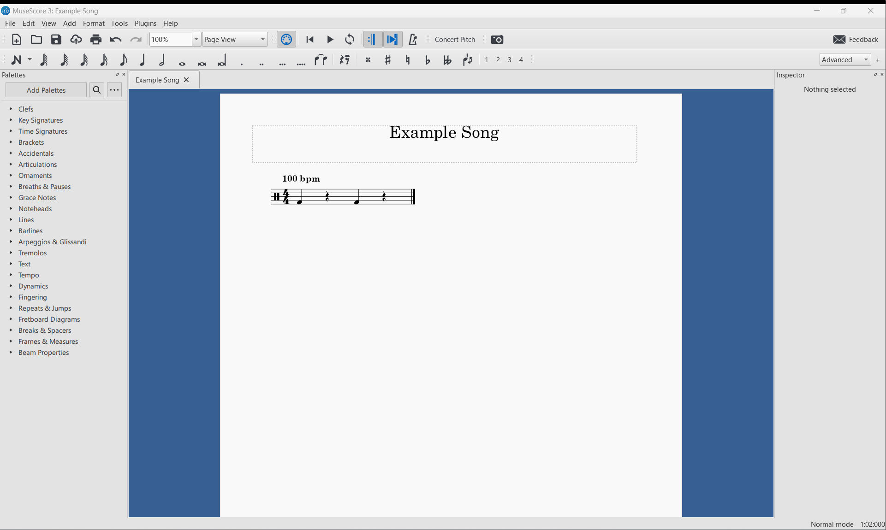
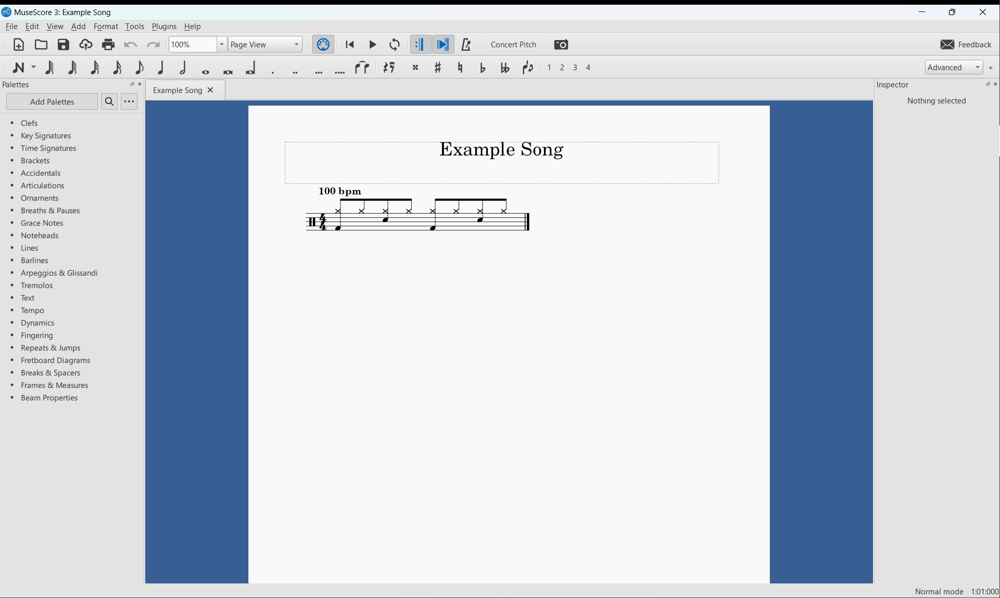

.. include:: contentheader.rst

Getting started
===============

This section assumes that you have PyDrumScore installed in a python environment on your machine. If not, refer to the installation section of the :ref:`main page <readme>`.

To test whether PyDrumScore is correctly installed in your environment, simply run:

::

  pydrumscore

You should get a message prompting you to add a file argument to export.

Lastly, you should also have set up MuseScore already. You can find the steps on the :doc:`MuseScore Setup <musescore>` page.

Writing a simple score
----------------------

The following is a step-by-step example for creating a simple score and exporting it. The result will be the classic drum beat of: bass drum on 1 and 3, snare on 2 and 4, and hi-hat eighth notes over the whole measure.
This beat could be considered the "Hello World" of the drum universe.

First off, create a new empty Python file in the editor of your choice. Name it as you wish; here it is called ``example_song.py``.

PyDrumScore needs two components for its export:

- A ``metadata`` object that contains the information about the song to export. For example, the title of the piece, its author, etc.
- A ``measures`` list, which contains all the musical data.

Both of these objects must be defined as at the root level of the song file. First, the metadata:

.. code-block:: python

  import pydrumscore

  metadata = pydrumscore.Metadata(
    workTitle = "Example Song"
  )

Notice the ``import pydrumscore`` line, which is needed to make all of the features of PyDrumScore available in the file. When using classes and functions provided by PyDrumScore, we will need to precede them with ``pydrumscore.``, just like we did for the ``Metadata``.

In the constructor of the metadata, we provide the title of our song in the form of a string. For the full list of arguments that can be provided, see the :class:`Metadata <pydrumscore.api.Metadata>` class reference.

Afterwards, add some measures to the song. For now, leave a single emtpy measure, like so:

.. code-block:: python

  import pydrumscore

  metadata = pydrumscore.Metadata(
    workTitle = "Example Song"
  )

  measures = []
  measures += pydrumscore.Measure()

This song file can be exported by calling in terminal:

::

  pydrumscore example_song

It's important to note that the argument provided must be the name of the file itself, which may differ from the title given to the song.
The result should be an uncompressed MuseScore file with the title `Example Song.mscx`.

Opening this file in MuseScore should yield the following empty score:

.. image:: images/example_song_result_1.png
  :width: 800
  :alt: File titled "Example Song" in MuseScore, with a single empty measure.

Adding some measures
^^^^^^^^^^^^^^^^^^^^

To add some measure content to the score, the measure objects need to be constructed with time values for the different pieces of the drum kit.

In PyDrumScore, a hit on a piece of the kit is represented by the beat in the measure at which the hit happens. Concretely, for adding a bass drum on the '1' of a measure, one needs to do:

::

  bd = [1]

This list is then fed to the ``pydrumscore.Measure()`` constructor, like so:

.. code-block:: python

  pydrumscore.Measure(
    bd = [1]
  )

Here, the shorthand ``bd`` stands for "bass drum". While using shorthands allows for faster coding, full names are also supported, so using ``bass_drum = [1]`` would also be valid.

Following this logic, a bass drum on '1' and '3' would thus be:

.. code-block:: python

  pydrumscore.Measure(
    bd = [1, 3]
  )

With the whole file being:

.. code-block:: python

  import pydrumscore

  metadata = pydrumscore.Metadata(
  workTitle = "Example Song"
  )

  measures = []
  measures += pydrumscore.Measure(
      bd = [1, 3]
  )

Exporting this gives us:

Finishing the beat
^^^^^^^^^^^^^^^^^^

Using the exact same logic, we can add a snare on the '2' and '4' to our measure.

::

  pydrumscore.Measure(
        bd = [1, 3],
        sd = [2, 4],
    )

.. warning:: Notice the commas in between the arguments. They are needed since we are feeding keyword arguments to a function. The multiple lines are only for readability.

The last thing we need to do is to add hi-hat hits in the form of eighth notes. How do we add values that do not land right on the beat of a measure? Simple, we take the time value in the middle.
For a hit that lands between the '1' and the '2', the value would be ``1.5``. So for adding hi-hat eighth notes across the whole measure.

::

  hh = [1, 1.5, 2, 2.5, 3, 3.5, 4, 4.5]

Because this can be tedious to type out, and this case is very common in drums, PyDrumScore provides a function to generate this list: the :meth:`note_range() <pydrumscore.api.note_range>` function.
We can use a ``start``, ``stop``, and ``step`` to generate a range of values in this list.

::

  hh = pydrumscore.note_range(1, pydrumscore.end(), 0.5)

The ``end()`` call returns the end of the measure based on the current time signature (in this case it returns ``5``, ie. one beat after the 4).

The final file contents:

.. code-block:: python

  import pydrumscore

  metadata = pydrumscore.Metadata(
  workTitle = "Example Song"
  )

  measures = []
  measures += pydrumscore.Measure(
      bd = [1, 3],
      sd = [2, 4],
      hh = pydrumscore.note_range(1, pydrumscore.end(), 0.5)
  )

And the result in MuseScore:

In the next tutorial, we will see how to turn this simple beat into
