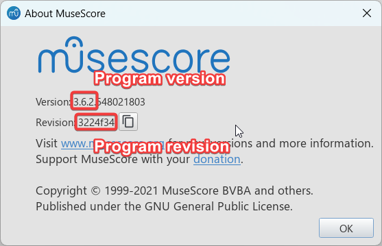

MuseScore Setup
===============

.. include:: contentheader.rst

When exporting your work through PyDrumScore, by default it will be an uncompressed MuseScore file (.mscx), which is an XML format. To open and review it, you will need to use MuseScore, which is a free and open-source, general-purpose scoring software. [1]_

.. [1] Support for other popular file formats is planned for future releases.

Downloading MuseScore
---------------------
You can download MuseScore for free on the project's `official site <https://musescore.org/en>`_.

.. note:: PyDrumScore currently only exports for **MuseScore 3.x**, which at the time of writing is the latest major release. There is currently a MuseScore 4.x in the works, and support for those further MuseScore versions will be added in time.

Setting your MuseScore version
------------------------------
In this early iteration of PyDrumScore, it is still required to configure your version of MuseScore by hand. You can do this by creating a file called `config.ini` at the root of your Python environment (the directory from which you will execute ``pydrumscore``).
If you don't set this, the default configuration will be used, and your version will be set empty. This works for most cases, but might throw warnings of version mismatch in certain versions of MuseScore.

You can also refer to `this table <https://musescore.org/en/handbook/developers-handbook/references/version-information>`_ for the version table of MuseScore releases. The `MSCX FILE VERSION` section is the one that goes in the `msversion` section` of the config file.

Example config file content:

.. code-block::

  [msversion]
  msversion = 3.02
  program_version =
  program_revision =

  [export]
  export_folder = pydrumscore/_exported

Refreshing files in MuseScore
-----------------------------
When iterating on your song, you will want to see the result displayed to you visually, and have playback. MuseScore offers these features, but it does not detect changes to the currently open *.mscx* file.
This means that, to see your changes, you need to first close the currently open file (clearing the cache) and then open it again. This gets tedious.

To tackle this, PyDrumScore comes packaged with a simple MuseScore plugin that opens and closes the currently active file tab in MuseScore with a keyboard press, allowing for a much faster iteration time.

First, locate the `RefreshScorePlugin.qml` file in ``pydrumscore/msplugins``. For MuseScore to find the plugin, it needs to be added to its plugin folder. You can either change the plugin path (see below) or, if this is not possible in your setup, simply copy-paste the .qml file in the folder containing the other plugins.

.. image:: images/preferences_tab.png
  :width: 400
  :alt: Mouse cursor clicking on the 'Preferences' item of the MuseScore 'Edit' navigation tab.

.. image:: images/plugin_path.png
  :width: 800
  :alt: 'Plugin Manager' window with arrow pointing to the 'Plugins Path' option, in the bottom-left corner.

Then, load the plugin in MuseScore by going into the Plugin Manager window.

.. image:: images/plugin_manager_tab.png
  :width: 800
  :alt: Mouse cursor clicking on the 'Plugin Manager' item of the MuseScore 'Plugins' navigation tab.

In the Plugin Manager window, select the 'RefreshScorePlugin' item, and make sure it's enabled by ticking the box. Then, give it a shortcut by clicking on 'DefineShortcut'.

.. image:: images/plugin_manager_window.png
  :width: 800
  :alt: Mouse cursor clicking on the 'Plugin Manager' item of the MuseScore 'Plugins' navigation tab.

.. note:: If the plugin does not appear in the list, make sure that the folder was set up properly in the first step, and click "Reload Plugins" to see if it was fixed.

If all goes well, you should be able to press the shortcut button to reload the currently open file tab at the press of a button.

MuseScore editing as a complement to PyDrumScore
------------------------------------------------
MuseScore is a fully mature tool for music scoring, and PyDrumScore is still in the process of implementing important features (see the roadmap). In certain cases where a feature would be missing, or the musical section is very complex, it might be preferable to export an unfinished piece with PyDrumScore, and fill in the detais in MuseScore.
**Make sure to save your edits in a separate file** if you are taking this approach, as the PyDrumScore exporter currently overwrites results without concern for local modifications.
