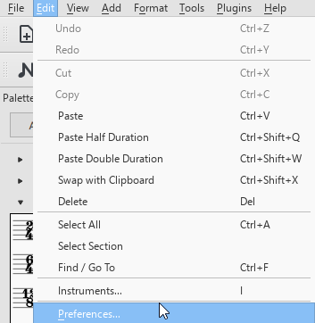
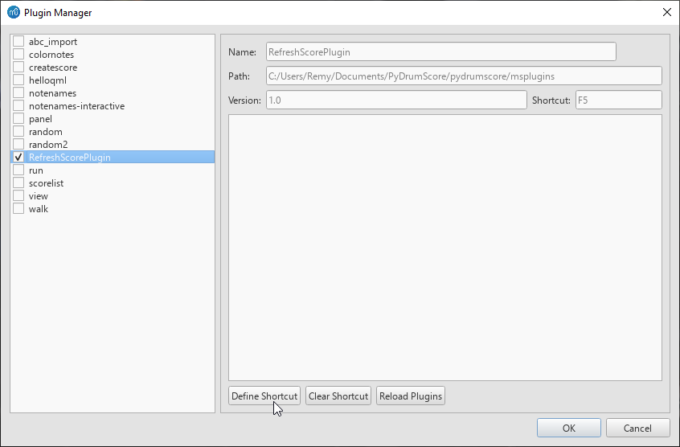

.. include:: contentheader.rst

MuseScore setup
===============

Getting MuseScore
-----------------

After exporting your song, by default it will be an uncompressed MuseScore file (.mscx), which is an XML format. It can be opened with MuseScore and further edited there.

.. note:: PyDrumScore currently only exports for **MuseScore 3.x**, which at the time of writing is the latest major release. There is currently a MuseScore 4.x in the works, and support for those further MuseScore versions will be added in time.

Setting your MuseScore version
------------------------------

Refreshing files in MuseScore
-----------------------------
When iterating on your song, you will want to see the result displayed to you visually, and have playback. MuseScore offers these features, but it does not detect changes to the currently open .mscx file.
This means that, to see your changes, you need to first close the currently open file (clearing the cache) and then open it again. This gets tedious.

To tackle this, PyDrumScore comes packaged with a simple MuseScore plugin that open/closes the currently open file tab in MuseScore with a keyboard press, allowing for a much faster iteration time.

First, locate the `RefreshScorePlugin.qml` file in ``pydrumscore/msplugins``. For MuseScore to find the plugin, it needs to be added to its plugin folder. You can either change the plugin path (see below) or, if this is not possible in your setup, simply copy-paste the .qml file in the folder containing the other plugins.

.. image:: images/plugin_path.png
  :width: 800
  :alt: 'Plugin Manager' window with arrow pointing to the 'Plugins Path' option, in the bottom-left corner.

Then, load the plugin in MuseScore by going into the Plugin Manager window.

.. image:: images/plugin_manager_tab.png
  :width: 800
  :alt: Mouse cursor clicking on the 'Plugin Manager' item of the MuseScore 'Plugins' navigation tab.

In the Plugin Manager window, select the 'RefreshScorePlugin' item, and make sure it's enabled by ticking the box. Then, give it a shortcut by clicking on 'DefineShortcut'.

.. note:: If the plugin does not appear in the list, make sure that the folder was set up properly in the first step, and click "Reload Plugins" to see if it was fixed.

If all goes well, you should be able to press the shortcut button to reload the currently open file tab at the press of a button.

